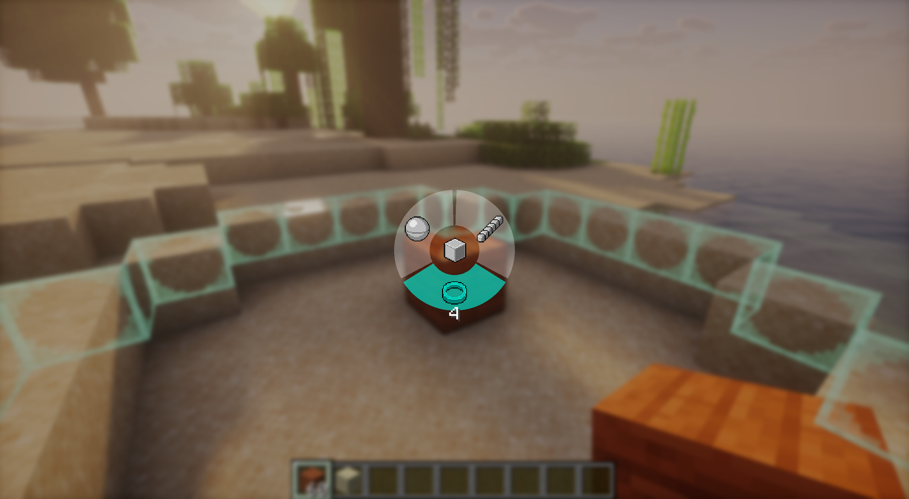

# Piggy Build

A simple yet powerful mod designed to enhance your building experience in Minecraft. Piggy Build provides utilitarian features like directional placement, shape guides, and fast placement tools to make creative building smoother.

---

## Screenshots

---

## ⚠️ Disclaimer

**This is a personal project.** It comes **AS IS** and might destroy your stuff.
*   **No Support:** Do not expect regular support or bug fixes.
*   **No Forge Port:** There are **NO** plans to port this mod to Forge.
*   **Use at your own risk.**

Feel free to fork the project or submit a Pull Request if you want to contribute fixes or features!

---

## Features

### 🛠️ Placement Helpers
*   **Directional Placement**: Lock your placement direction relative to the block face. Handy for placing logs, pillars, or pistons in specific orientations without moving your character.
*   **Diagonal Placement**: Easily place blocks diagonally, enabling faster construction of complex patterns.
*   **Fast Placement**: Hold down the button to place blocks rapidly at a configurable speed.
*   **Fast Breaking**: Creative-mode utility to break blocks faster.

### 📐 Shape Guides
*   **Shape Selectors**: Detailed guides for placing blocks in specific shapes.
    *   Lines
    *   Spheres
    *   Rings
    *   Blocks (Cubes)

### 🛡️ Safety & Anti-Cheat
Piggy Build comes with a **"No Cheating Mode" enabled by default**.
*   **Safety First**: This mode prevents you from using "cheat" features (Fast Place, Directional Placement, etc.) while in **Survival** or **Adventure** mode.
*   **Fair Play**: Prevents accidental bans on servers that detect fast interaction frequencies.
*   **Creative Freedom**: All features remain fully unlocked in Creative Mode.

---

## Controls

You can rebind these keys in the standard Minecraft Controls menu under **"Piggy Build"**.

| Action | Default Key | Description |
| :--- | :--- | :--- |
| **Shape Selector** | `V` | Opens the radial menu to select building shapes. Scroll to adjust size. |
| **Directional Placement** | `Mouse Button 5` | Locks placement orientation to the face you are looking at. |
| **Diagonal Placement** | `Mouse Button 4` | Toggles diagonal placement mode (45-degree angle). |
| **Fast Block Placement** | `Mouse Button 6` | Activates rapid block placement while held. Scroll to adjust speed. |

---

## Configuration

Access the configuration menu via **Mod Menu**.

*   **Highlight Color**: Customize the color of the shape guides.
*   **Placement Overlay Color**: Change the color of the directional arrows/overlays.
*   **Fast Place Speed**: Adjust the delay (in ms) between block placements.
*   **Fast Place Toggle**: Enable/Disable fast placement globally.
*   **No Cheating Mode**: Toggle anti-cheat safety (prevents use in Survival/Adventure).

### 🖥️ For Server Owners
You can install **Piggy Build** on the server to enforce anti-cheat rules for all connected clients.
*   **Config File**: `config/piggy-build-server.json`
*   **Enforcement**: Set `"allowCheats": false` to **force** the anti-cheat mode on all players.
    *   This overrides client settings. Even if a player disables "No Cheating Mode", they will be blocked from using build tools in Survival.
    *   Clients will receive a message: *"Anti-Cheat Active: This server has forced anti-cheat ON."*

---

## Dependencies & Installation

### Requirements
*   **Minecraft**: ~1.21.1
*   **Fabric Loader**: >=0.18.1
*   **Java**: >=21

### Required Mods
*   **[Fabric API](https://modrinth.com/mod/fabric-api)**: Any version
*   **[YACL (Yet Another Config Lib)](https://modrinth.com/mod/yacl)**: >=3.6.1+1.21-fabric
*   **[Piggy Lib](https://github.com/porkyoot/piggy-lib)**: >=1.0.0
*   *(Optional)* **[Mod Menu](https://modrinth.com/mod/modmenu)**: >=11.0.3 - Highly recommended for accessing config.

### Installation
1.  Download the `.jar` file from [Releases](https://github.com/porkyoot/piggy-build/releases).
2.  Install Fabric Loader for Minecraft 1.21.1.
3.  Place the `piggy-build` jar (along with Fabric API, YACL, and Piggy Lib) into your `.minecraft/mods` folder.
4.  Launch the game!

---

## Inspiration

This mod was inspired by:
- **[MiniHUD](https://modrinth.com/mod/minihud)** - For the concept of visual overlays and shape guides.
- **[Tweakeroo](https://modrinth.com/mod/tweakeroo)** - For fast placement mechanics and building utilities.

---

**License**: CC0-1.0
